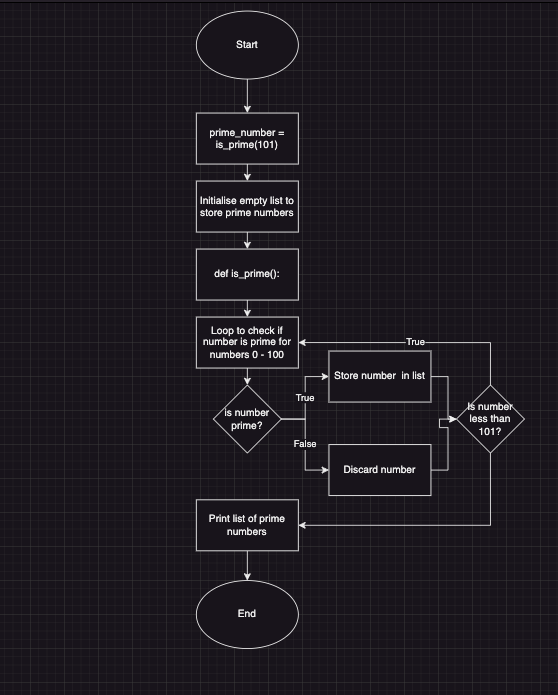

# T1A1 - Workbook
#### Dillon Cotter
##### Student ID: 14582

## Q1: <strong>Identify</strong> and <strong>explain</strong> common and important components and concepts of web development markup languages:
Some of the components of markup languages include HTML and CSS. 
1. HTML is short for HyperText Markup Language and is the actual content displayed in web browsers. While other aspects of web development languages are important for styling and interactivity, HTML is necessary so that a user can view the website. 
2. CSS is short for Cascading Style Sheets, this is used to inform the corresponding html file on its style. This allows control over the layout, colours, fonts, and most other visual aspects of a site. 
The name "cascading" informs that the format is applied from top to bottom, allowing for different styles to apply to different tags, ids and sections.

By separating the style from the content it is easier to make adjustments to either section without unintended consequences.

Within both of these 'languages' there are some important concepts to consider with web development:  
1. Semantic Markup: 
This is the concept of using correct and descriptive labels and tags within the HTML to assist with the structure and organisation so that the webpage displays correctly, but is also easily readable in development.  
2. Meta Tags: 
These are bits of code that give information about the HTML document. These primarily include the character set used by the document and how it displays on a given device/browser.

## Q2: <strong>Define</strong> the features of the following technologies that are essential in terms of the development of the internet:
## - Packets
## - IP addresses (IPv4 and IPv6)
## - routers and routing
## - domains and DNS

## <strong>Explain</strong> how each technology has contributed to the development of the internet.
- Packets:  
A packet is a small unit of data that is transmitted over a network. It is made up of 2 main parts: The actual data being sent (images, text, videos etc) and the information on the source and destination addresses so it can be delivered.  
A packet allows large amounts of data to be divided into easier to manage sections, lessening the load on a network, and allowing for more efficient routing. If a packet is lost, only a small portion of the overall data is missing to be repaired, replicated or resent.  
(https://www.cloudflare.com/en-gb/learning/network-layer/what-is-a-packet/)
- IP addresses (IPv4 and IPv6):  
IP addresses are unique numbers used to identify devices connected to a network and provide the address information for sending and receiving data.  
    - IPv4 is a set of 4 numbers separated by '.', with each number ranging from 0 to 255.  
    - IPv6 is a set of 8 groups of hexadecimal digits (numbers 0-9 and letters A-F) separated by ':'.  

    The transition from 4 numbers to 8 groups, and the use of hexadecimals, significantly increases the number of available addresses, allowing for a larger allocation of devices.  
    IP addresses play a vital role in enabling global connectivity, allowing devices worldwide to connect, communicate, and route data over the internet using a standardised approach.
(https://www.simplilearn.com/tutorials/cyber-security-tutorial/difference-between-ipv4-and-ipv6#:~:text=IPv4%20is%20composed%20of%2032,the%20Internet%20Protocol%20(IP).))
(https://www.geeksforgeeks.org/differences-between-ipv4-and-ipv6/)
- Routers and routing:  
Routers are devices that connect networks together and efficiently direct data packets to their destinations.  
Through the process of routing, routers exchange information and determine the best paths for packet delivery by analysing destination addresses.  
This ability has allowed the internet to expand in scale and complexity, enabling seamless communication between countless devices. Routers effectively manage network traffic and utilise routing tables to ensure efficient and reliable data transmission. Their contribution has been crucial in shaping the internet into a global network that connects people, businesses, and information across the world.  
(https://www.cloudflare.com/en-gb/learning/network-layer/what-is-routing/)
- Domains and DNS:  
A Domain can be thought of as a website name, like google.com.  
DNS (which stands for Domain Name System) converts this Domain and translates this into an IP address.  
When coupled together a user does not need to remember a complicated set of IPv4 or IPv6 addresses to manually input to a web browser to show a page, instead they can use a domain name and rely on the DNS to lookup the correct address this should return.
(https://www.cloudflare.com/en-gb/learning/dns/what-is-dns/)  

## Q3: <strong>Define</strong> the features of the following technologies that are essential in terms of the development of the internet:
## - TCP
## - HTTP and HTTPS
## - web browsers

## <strong>Explain</strong> how each technology has contributed to the development of client and server communication over the internet 
- TCP:  
TCP, short for Transmission Control Protocol, plays a crucial role in networks by reassembling all the packets sent over a network into a usable format.  
Its primary objective is to ensure reliable data delivery. To achieve this, TCP employs a mechanism of acknowledgment requests. These requests are sent from the recipient location back to the source, confirming the successful reception and correct assembly of all packets.  
(https://www.cloudflare.com/en-gb/learning/ddos/glossary/tcp-ip/)
- HTTP and HTTPS:  
HTTP (Hypertext Transfer Protocol) is a protocol used in networks to facilitate communication between web servers and clients. It enables the transfer of hypertext, such as HTML, and other resources like images and videos.  
HTTP's provides a simple and efficient means of transmitting information. However, it does not ensure secure transmission, as data is sent in plain text, making it susceptible to interception and tampering.  
HTTPS (Hypertext Transfer Protocol Secure) is an extension of HTTP that incorporates security measures to protect data during transmission. It utilises encryption protocols, such as SSL (Secure Sockets Layer) or TLS (Transport Layer Security), to establish a secure and encrypted connection between the server and client. By encrypting the data, HTTPS safeguards sensitive information, such as login credentials and financial details, from unauthorised access and manipulation.
(https://www.cloudflare.com/en-gb/learning/ssl/why-is-http-not-secure/)
- Web Browsers:  
Web browsers are software applications that allow users to access and interact with websites on the internet. They assist in rendering and displaying web content, such as HTML, CSS, and JavaScript, in a user-friendly manner.  
Web browsers provide a graphical interface that enables users to navigate through web pages, submit forms, and interact with multimedia elements.
Newer web browsers also offer additional features, including tabbed browsing, bookmarks, extensions, and privacy settings. They also support HTTP and HTTPS protocols, ensuring secure and reliable communication with web servers.

## Q4: <strong>Identify</strong> THREE data structures used in the Python programming language and explain the reasons for using each.
- Lists:  
Lists are ordered and mutable objects that allow the storage of multiple items into a single variable.  
Lists allow for duplicate values, addition, removal or alteration of items in the object.
Lists are good for use where you may need to alter the items after creation (such as a shopping list that you need to add items to when you run out, or remove items from if you buy them.)
(https://www.w3schools.com/python/python_lists.asp)
- Tupples:  
Tuples are also ordered, however they are unmutable objects.  
Similar to Lists, they do allow duplicate values, however items cannot be added, changed or removed after the object is initialised (instead you would need to create a new tuple)  
Tuples are good for use where you do not want the content to alter, such as a user's DOB, which would not likely change.  
Tuples are also faster than a list, for times where you may wish to use the tuple in a loop iteration, the code will return sooner when using this data structure.
(https://www.w3schools.com/python/python_tuples.asp)
- Dictionaries:  
Dictionaries store their data in key: value relationships, and are ordered and mutable objects.  
Dictionaries do not allow duplicate values, as each key can only be assigned a single value, and can add or remove key: values.  
Dictionaries are good for use where you may wish to recall what an item value 'means' later in the code. E.G. if you had a dictionary for a car, you would be able to call on any values present individually - Colour, Make, Model, Year etc, where if this was stored as a list you would only see the values.  
(https://www.w3schools.com/python/python_dictionaries.asp)

## Q5: <strong>Describe</strong> the features of interpreters and compilers and how they are different.
Both Interpreters and compilers are tools in programming used to convert readable source-code into machine executable code.
- Interpreters:  
    - Performs actions one statement at a time.
    - Translates source code to machine code during the run-time.
    - As code is run line-by-line, errors are reported immediatly on discovery.
    - Using in scripting languages (EG. Python)
- Compilers:
    - Takes all of the source code and translates it first.
    - Are typically faster in execution, after it has been pre-translated.
    - Used in non-scripting languages (EG. Java)  

(https://www.programiz.com/article/difference-compiler-interpreter)
## Q6: <strong>Identify</strong> TWO commonly used programming languages and explain the benefits and drawbacks of each.

- Python:
    - Benefits:
    1. Python has an easily readable syntax and is beginner friendly.
    2. Code can be written concicely, reducing development time.
    3. Large Support and Community are available for libraries and frameworks, making it so developers do not need to 're-create the wheel' for each new program.
    - Drawbacks:
    1. Slower execution time compared to compiled languages.
    2. For more complicated designs, the simplicity of python can be a drawback.
    3. Python uses high memory in projects  
(https://www.pixelcrayons.com/blog/python-pros-and-cons/)

- Java
    - Benefits:
    1. Java allows programs to run on multiple platforms without major modifications.
    2. Large Community and Support are available fo resources.
    3. Object-Oriented Programming with reusable code.
    - Drawbacks:
    1. Java tends to require more lines of code to run functions than other languages.
    2. It has a steep learning curve to become proficient
    3. There is also some performance issues, where Java cannot match other languagesfor high-performance tasks.  
(https://anywhere.epam.com/business/pros-and-cons-java)

## Q7: <strong>Identify</strong> TWO ethical issues from the areas below and discuss the extent to which an IT professional is ethically responsible in terms of the issue.
 
 - Access to a user’s personal information (medical, family, financial, personal attributes such as sexuality, religion, or beliefs)

 - aggressive sales and marketing practices designed to mislead and deceive consumers  

For each ethical issue identify a source of legal information relating to the ethical issue and discuss whether the law is helpful in assisting a developer to act in an ethical way. (Word count guide: 200 words max)

### Access to a user's personal information:
An IT professional has significant ethical responsibilities with users' personal information.  
In Australia, this is regulated by the Privacy Act 1988, which sets out the Australian Privacy Principles (APPs).  
These APPs provide a framework on how you can collect, store, use, and disclose personal information, as well as guidelines to ensure data security.  
While the law provides a basic framework, it does not necessarily ensure ethical behaviour. Ethical conduct extends beyond legal requirements, demanding respect for a user's privacy, full transparency in their data usage, and informed consent for data collection and use.  
While the Privacy Act and the APPs set a legal benchmark for IT professionals, they, like many legal frameworks, lag in addressing the challenges posed by new and emerging technologies.  
Emerging technologies such as AI, Blockchain, and the Internet of Things may not conform to current guidelines on information transparency, posing new legislative challenges.  
Therefore, developers must proactively employ their ethical judgment to ensure they respect user trust and privacy, even in areas not yet fully covered by the legislation. 
(https://www.legislation.gov.au/Details/C2022C00361)

### Aggressive sales and marketing practices designed to mislead and deceive consumers:
The Australian Competition and Consumer Commission (ACCC) provides a legal framework under the ACL (Australian Consumer Law), including regulations around misleading/deceptive conduct, making false representations, and unfair practices. However, technological advances often outpace legislation significantly.  
One example of this is how digital platforms can capture user data and use it in targeted advertising. This could be considered aggressive or manipulative; however, it is not specifically addressed in the law.  
Additionally, while outright deceptive or false advertising is prohibited, "Dark Patterns" can be used to manipulate users. These design techniques drive user behaviour towards a desired outcome for the business, at the expense of the customer. Examples of this include:  
- Trick Questions designed to confuse users, e.g. a user might click to cancel their subscription, then be led to a page with the question, "Do you want to continue enjoying our premium features?" The responses might be framed confusingly, such as "No, I want to lose my benefits" and "Yes, keep my subscription."
- Hidden costs are revealed only at the final step of a transaction.
- Forced Continuity, where free trials automatically renew into paid subscriptions without consent.
(https://www.deceptive.design/)

### Conduct research into a case study of ONE of the ethical issues you have chosen discuss how an ethical IT professional should respond to the case study and how they might mitigate or prevent ethical breaches.  

The U.S. Federal Trade Commission (FTC) has filed a landmark lawsuit against Amazon.com in June 2023, underscoring a pivotal ethical issue confronting IT professionals today. The FTC alleges Amazon used deceptive user interface design elements or "dark patterns" to hoodwink consumers into signing up for its Prime service, and subsequently, made the cancellation process intentionally challenging.

Dark patterns refer to deliberate design elements in digital interfaces that manipulate or trick users into performing actions they didn't intend. These can include confusing language, hidden terms, or misleading visual design cues. The dangers posed by dark patterns are multifaceted: they can lead to users unintentionally sharing personal data, spending money, or subscribing to services they don't want. Dark patterns exploit users' cognitive biases and trust, thereby creating ethical issues around consent, transparency, and user autonomy.

In the Amazon case, the FTC highlighted instances where the sign-up process for Amazon Prime was designed in a way that customers were unwittingly subscribed to a $14.99 per month service during the online checkout process. This lack of transparency contrasts starkly with ethical IT practices that demand clarity, explicit user consent, and unambiguous choices.

Further compounding the issue, Amazon's leadership allegedly hindered attempts to simplify the cancellation process. The term 'Iliad,' an internal reference to this process, underlines the calculated intent behind these tactics. 'Iliad' refers to Homer's ancient Greek epic, renowned for its complexity and length. It describes a protracted, intricate saga of the Trojan War, thus symbolically echoing the convoluted journey users allegedly had to undertake to cancel their Prime subscription.

For IT professionals, the ethical course of action would involve questioning such practices, escalating their concerns within the organisation, and advocating for more transparent, user-friendly designs. Success in the digital realm should be gauged not by immediate financial gains but by user satisfaction, trust, and sustainable growth.

To prevent unethical practices like these, organisations must establish and strictly adhere to a robust code of ethics. This code should emphasize user consent, ease of use, and transparency. In addition, regular training, seminars, and workshops can align the team's understanding of these principles.

The case of Amazon.com serves as a stark reminder of the severe legal and financial consequences of prioritising short-term profit over ethical conduct. As digital literacy grows, consumers are increasingly expecting and demanding transparency from digital services. Loss of user trust could be detrimental to businesses in the long run. Therefore, IT professionals must uphold the highest ethical standards in design and operations, recognising the significant impact of their decisions on users' lives and digital experiences.
(https://www.ftc.gov/news-events/news/press-releases/2023/06/ftc-takes-action-against-amazon-enrolling-consumers-amazon-prime-without-consent-sabotaging-their)
(https://www.cnbc.com/2023/06/21/ftc-sues-amazon-over-deceptive-prime-sign-up-and-cancellation-process.html)

## Q8: Explain control flow, using examples from the Python programming language
Control flow explains the order in which code is run in an program.  
In python and most other interpreter languages this is done top to bottom, line by line. However some objects can alter this flow. The two main control flow statements in python are:
1. Condition statements (EG. if, elif and else):
```
num = 10
If num < 0:
    print("This is a negative number")
elif num > 0:
    print("This is a positive number")
else: 
    print("This is 0")
```
In this example as the first condition is not met, the code runs the next elif statement. As this statement returns TRUE it will complete the actions in this condition and end the if statement.  
2. Loops (EG. while, for):
```
for i in range (3):
    print("Hello World")
```
Loops iterate code following specific logic. A for loop will iterate of a defined range wheras a while loop will iterate infinatley until the condition is false.  

## Q9: Explain the difference between type coercion and type conversion. Are either of these used in Python?
Type coercion and coversion are both methods of changing one type of data into another.  
Type Conversion is when this is handled by the programmer by use of predetermined functions an example of this would be taking an input from a user, which would default to a string, and changing this to an integer for later use. EG.
```
user_input = int(input("Please list your favourite number: "))
# turns input into int data type
sum = user_input * 2
print(sum)
```
result here would be the input number multiplied by 2, whereas if no conversion took place, this would instead print the number twice as a string.  
Type coercion is when a data type is automatically changes by the code without the programmer's direct intervention.  
While python does not have as much support for coercion as other languages, it does do this when dealing with mathematical operaions between integers and floats. EG.
```
int = 10
float = 2.5

result = int + float
print(result, type(result))
```
This would output 10.5 <class 'float'> as it has coerced the int data type into a float to the operation can be completed without error.

## Q10: Explain data types, using examples
Data types have different properties and interact differently depending on the operation being applied. Some common data types:  
- Boolean:  
A Boolean is a data type of 2 values, True or False
- String:  
A sting is a sequence of characters, these can be letters, numbers, special characters and more.  
- Integer:  
This is a whole number, that can be positive, negative or 0  
- Float:  
This is a decimil number  
- List, Tuple, Dictionary, Set:  
These are all collection types that can contain one or more ofther data types.

## Q11: Here’s the problem: “There is a restaurant serving a variety of food. The customers want to be able to buy food of their choice. All the staff just quit, how can you build an app to replace them?”
 - Identify the classes you would use to solve the problem
 - Write a short explanation of why you would use the classes you have identified

 Classes:
 1. Menu: This would contain all of the menu items available, and allow the display of items.
 2. Order: This would be used to create a new order, include the menu item selections and price.
 3. Payment: This would handle payment related tasks and is kept separate to other classes to silo the mathematical formulas

## Q12: Identify and explain the error in the code snippet below that is preventing correct execution of the program
```
celsius = input()

fahrenheit = (celsius*9/5)+32

print(f"The result is: {fahrenheit}.")
```
in this example the input for celsius has a data type of string and therefore cannot be used with this mathematical operation.

## Q13: The code snippet below looks for the first two elements that are out of order and swaps them; however, it is not producing the correct results. Rewrite the code so that it works correctly.

```
numbers = [5, 22, 29, 39, 19, 51, 78, 96, 84]
i = 0

while i < (len(numbers) - 1) and (numbers[i] < numbers[i + 1]):
    i += 1

if i < len(numbers) - 1:
    numbers[i], numbers[i + 1] = numbers[i + 1], numbers[i]

print(numbers)
```

## Q14: Demonstrate your algorithmic thinking through completing the following two tasks, in order:
 1. Create a flowchart to outline the steps for listing all prime numbers between 1 and 100 (inclusive). Your flowchart should make use of standard conventions for flowcharts to indicate processes, tasks, actions, or operations
 2. Write pseudocode for the process outlined in your flowchart

 

 ```
 # define function to check if number is prime
 # return false if number is less than 2
 # loop for each number in range between 2 and the square root of the number +1
 # where remainder is 0 return false, otherwise return true.
 # end function

 # initialise an empty list to store prime numbers
 # loop for numbers 0 - 100
 # use function to determine True / False
 # where true, store number in the list
 # when loop finished, print list.
 ```

## Q15: Write pseudocode OR Python code for the following problem:
You have access to two variables: raining (boolean) and temperature (integer). If it’s raining and the temperature is less than 15 degrees, print to the screen “It’s wet and cold”, if it is less than 15 but not raining print “It’s not raining but cold”. If it’s greater than or equal to 15 but not raining print “It’s warm but not raining”, and otherwise tell them “It’s warm and raining”.
```
raining = True
temperature = 0

if raining == True and temperature < 15:
    print("It's wet and cold")
elif raining == False and temperature < 15:
    print("It's not raining but cold")
elif raining == False and temperature >= 15:
    print("It's warm but not raining")
else:
    print("It's warm and raining")
```

## Q16: ACME Corporation are hiring a new junior developer, as part of their hiring criteria they've created a "coding skill score" based on the specific competencies they require for this role; the more important the skill is for ACME corp, the more points it contributes to the "coding skill score" The skills are weighted as follows:
 - Python (1)
 - Ruby (2)
 - Bash (4)
 - Git (8)
 - HTML (16)
 - TDD (32)
 - CSS (64)
 - JavaScript (128)  
 Write a program that allows a user to input their skills and then tells them  
 a) Their overall "coding skill score"  
 b) Skills they may want to learn, and how much each one would improve their score
 ```
 # define the skills and values:
skills = {
    "python": 1,
    "ruby": 2,
    "bash": 4,
    "git": 8,
    "html": 16,
    "tdd": 32,
    "css": 64,
    "javascript": 128
}
# get user skills
user_skills = set()
while True:
    skill = input("Please enter a skill or type 'exit' to finish: ")
    if skill.lower() == 'exit':
        break
    else:
        user_skills.add(skill)

# get the user's score
score = 0
for skill in user_skills:
    if skill in skills:
        score += skills[skill]
print(f"Your coding score is {score}, well done!")

# suggest new skills
print("You could learn these skills to improve your score:")
for skill in skills:
    if skill not in user_skills:
        print(f"{skill.capitalize()}: + {skills[skill]}")
```