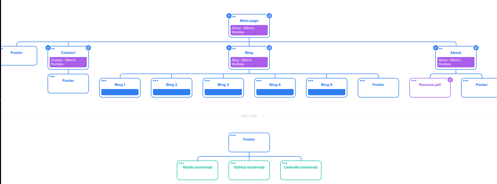
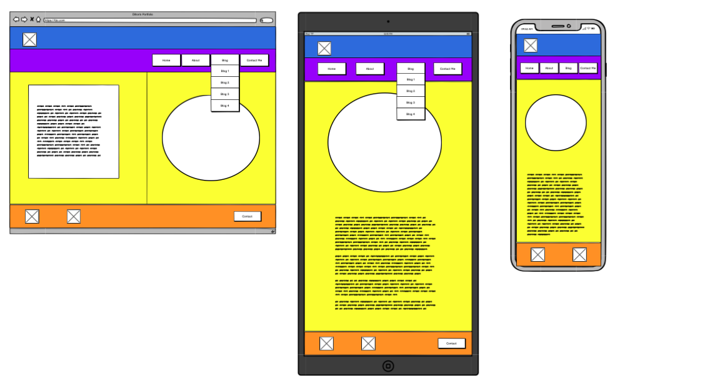
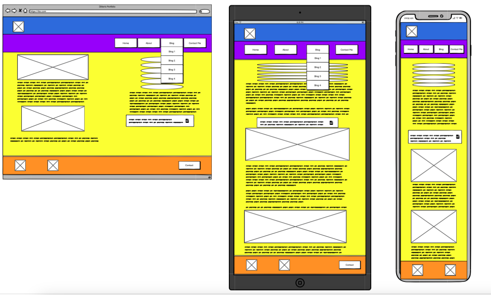
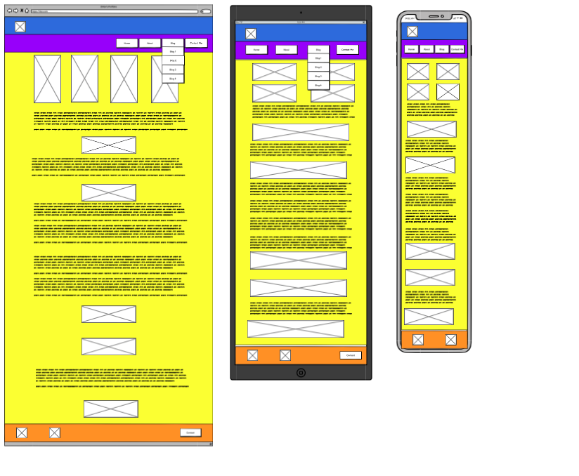
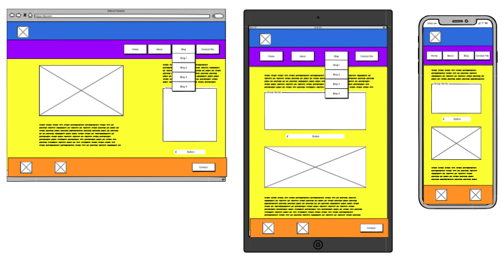

# This README contains information for the coder-academy Term 1 Assessment 2 - Portfolio.

- [Published portfolio website](https://dillonc.netlify.app/)
- [GitHub repo](https://github.com/dilbot-cot/coder-academy-T1A2)
- [Presentation video](https://youtu.be/eMBOFCfsaQo)

## Portfolio Website description

### Purpose:
This site is designed to showcase my technical skills at website building including HTML coding and CSS styling

### Functionality / features
The site contains a shared navigation menu across all pages to show consistency, we have incorporated Semantic HTML for accessability and SEO.  
The site also adjusts it's look and feel when navigating on Mobile, Tablet and Laptop screen sizes.
### Sitemap

### Screenshots

### Target audience
An employer looking to engage a <strong>dev</strong> and/or IT professional, who has the following knowledge:
- Technical knowledge relating to information technology, software development/coding, programming languages and development stacks
- High expectations of professionalism and positive work ethic
### Tech stack
- Terminal
- Git
- GitHub
- HTML:5
- SASS
- CSS
- Netlify
- Balsamiq Wireframes
- Discord
- Zoom
- Visual Studio Code