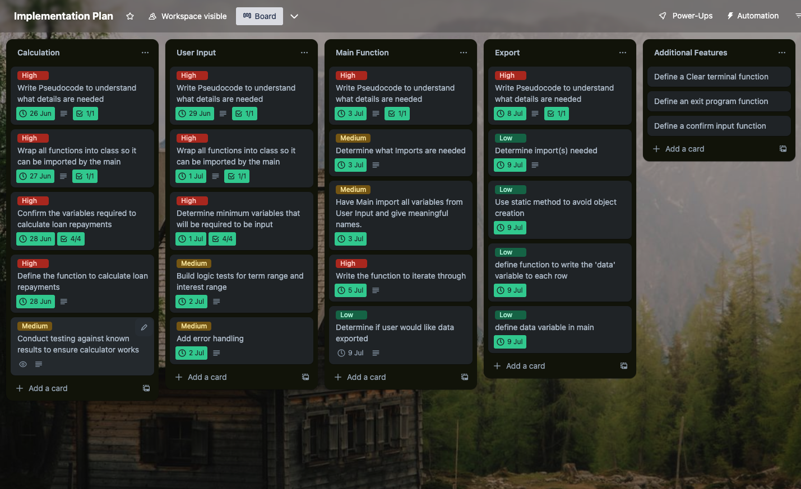

# This README contains information for the coder-academy Term 1 Assessment 3 - Terminal Application.

- [GitHub](https://github.com/dilbot-cot/coder_academy_assignments/tree/main/dilloncotter_T1A3)

## Features

1. User Input Validation and Confirmation:  
This feature ensures that the user inputs valid data and confirms the data before proceeding. It demonstrates the concept of loops and conditional control structures, along with error handling. For instance, in the 'get_loan_amount()' method, a 'while' loop is used to repeatedly ask for user input until a valid loan amount (a positive number) is entered. If an invalid entry (non-number or non-positive number) is entered, an error message is printed, demonstrating error handling. The 'confirm_inputs()' method allows the user to confirm the details they entered, demonstrating conditional control structures.

2. Multiple Scenario Analysis:  
This feature systematically explores multiple loan repayment scenarios. In the main function, nested loops iterate through a range of loan terms and interest rates to generate different loan scenarios. For each scenario, the loan term and interest rate variables are used to calculate the corresponding repayment. This use of loops provides a comprehensive overview of various repayment scenarios, helping the user to understand how changing terms and interest rates affect their repayments.

3. Data Export to CSV:  
This feature allows the user to export the calculated loan repayment data to a CSV file on their desktop. This feature demonstrates the concept of file handling in Python, including writing data to a file. In the 'main()' function, a 'while' loop asks the user if they wish to export the data until a valid response ('y' or 'n') is entered. If the user chooses to export the data, the 'write_csv()' method from the 'DataWriter' class is used to write the data to a CSV file. This feature also demonstrates error handling, as the program would handle a situation where the file cannot be created or written to by raising an exception.

## Implementation plan
[Trello](https://trello.com/invite/b/GVpYGpzv/ATTIcb65bb46682bf9a5d6a846bf5319e44e7E10BB0F/implementation-plan)


## How to install

Check if you have python3 installed by running command
```python3 --version```
in terminal or cmd. If you receive a version number skip to step 4, otherwise continue.
- For macOS:
1. Check if homebrew is installed by running command:
```
brew --version
```
If you recieve a version number skip to step 3.  

2. Install homebrew by running command:
```
/bin/bash -c "$(curl -fsSL https://raw.githubusercontent.com/Homebrew/install/HEAD/install.sh)"
```

3. Install python3 running command:
```
brew install python3
```

- For Windows:
1. The simplest way to install python3 is through the windows store, however you can also install using Chocolatey:
2. Install Chocolatey by running command prompt as administrator and entering command:
```
@"%SystemRoot%\System32\WindowsPowerShell\v1.0\powershell.exe" -NoProfile -InputFormat None -ExecutionPolicy Bypass -Command "[System.Net.ServicePointManager]::SecurityProtocol = 3072; iex ((New-Object System.Net.WebClient).DownloadString('https://chocolatey.org/install.ps1'))" && SET "PATH=%PATH%;%ALLUSERSPROFILE%\chocolatey\bin"
```
3. Install python3 running command:
```
choco install python
```

4. Download the dilloncotter_T1A3 folder from the repository
5. In terminal/cmd navigate to this directory
6. Run the command ```chmod +x run_app.sh``` to allow this script to be executed
7. Run the command ```./run_app.sh``` to run the program

## Tech stack
- Terminal
- Git
- GitHub
- Discord
- Zoom
- Visual Studio Code
- Python3