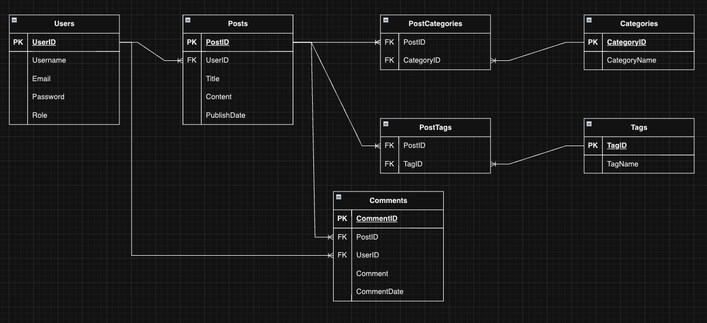

# Dillon Cotter T2A1-A - Workbook.  
## RfQ Response

### Describe the architecture of a typical Flask application
A Flask application is built on simplicity and flexibility, allowing it to handle simple and complex tasks.

The core of a Flask application is the Flask class, which forms the basis for creating instances of the web application. These instances are WSGI (Web Server Gateway Interface) applications, providing a common link between web servers and web applications.

Flask applications follow the Model-View-Controller (MVC) design pattern, which separates different concerns:

- Model: Deals with the database and holds data and its behaviours.

- View: This is the user interface where data from the Model is displayed. Flask uses templates to handle this.

- Controller: Responds to user inputs and interacts with the Model. It updates the View when the Model changes. In Flask, this is done using routes and view functions.

Flask uses routing to match client requests with specific view functions. The view functions are then associated with particular URLs.

Request dispatching in Flask is done through Werkzeug, a WSGI utility library. Flask also supports unit testing and allows extensions for various functionalities like form validation and authentication mechanisms.

Flask supports the creation of blueprints, enabling developers to create reusable sections of an application, streamlining the codebase.

Flask doesn't impose a strict project structure, granting developers flexibility. As projects grow, it's common to split them into modules for better organisation.

### Identify a database management system (DBMS) commonly used in web applications (including Flask) and discuss the pros and cons of this database
A DBMS commonly used us PostgreSQL (PSQL), this is highly compatible with Flask-based applications, looking at the pros and cons of this system:  

<strong>Pros:</strong>  
- Scalability: PSQL can handle large amounts of data and high volumes of users simultaneously, this makes it suitable for enterprise level applications. It can be distributed across multiple servers.
- JSON Support: It has support for JSON and JSONB data types. This is very useful for more modern web applications that make use of JSON objects.
- Set of features: PSQL supports multiple data types, operators and indexing capabilities, including full text search which are helpful in complex query optimisation.

<strong>Cons:</strong>
- Complexity: PSQL offers several features and customisation, however this complexity can be a drawback for beginners and smaller scale applications
- Resource heavy: For large datasets and complex queries, PSQL can take up significant amounts of hardware resources, particularly in CPU and memory.
- Initial setup: Compared to simpler DBMS, the initialisation and maintenance of PSQL can be more involved and requires a deeper and possibly more experiences database administrator.

### Discuss the implementation of Agile project management methodology
The Agile project management methodology focuses on flexibility and collaboration. This is implemented by:
- Sprints: Where the project is broken down into small manageable parts lasting typically between 2 and 4 weeks. Where at the end of a sprint a deliverable product, feature or enhancement is delivered.
- Roles: Two important roles given to team members are the Product Owner, responsible for defining the goals and deliverables, and a Scrum Master who facilitates the Agile management process. Other team members are responsible for task execution and may be given their own roles to achieve this.
- Standups: brief daily meetings where the team members report and update each other on what they delivered the previous day, and what they plan to execute by the end of the day. They will also call out any blockers being faced.
- User stories: The requirements are often given as user stories or journeys and stored in a product backlog. The Product owner prioritises this backlog and will provide the most urgent or highest priority item at the start of a sprint.
- Feedback loop: At the end of each sprint a Sprint Review and Retrospective is held to assess what was achieved, any roadblocks and how to improve for the next sprint.
- Transparency: Often Confluence, Kanban, MS Planner or other visual aids will be utilised to ensure all team members and stakeholders are clear on progress

### Provide an overview and description of a standard source control workflow
Source control, normally implemented by Git, is crucial for tracking changes, collaboration and version management. Typically, it is handled by:
- Clone the repository: Developers clone the central repo to their local machine.
- Create a feature branch: Instead of working directly on the main branch, a new branch is created for each new feature or fix. This assists in making sure the original code remains stable and usable.
- Commit changes: As the work is updated the changes are committed to the feature branch. Different developers have individual styles of when to commit (EG. each hour makes a commit, after each new code block, when a code change threshold is reached). The commitment should include a meaningful message describing what was done.
- Sync with remote: The local feature is regularly synced with the remote repo to stay up to date with all developers’ changes, this is crucial in larger scale projects.
- Code review and Pull: Once the feature is completed and tested, a pull request is opened. Team members review the code, then merge back to main.
- Deploy: After merging, the new changes in main are tested and deployed to a staging or prod environment.

### Provide an overview and description of a standard software testing process (e.g. manual testing)
A standard process typically starts with a Requirement Analysis, where the testing team reviews the software requirements to determine what needs to be tested.  
Next would be a test planning where the team decides on the strategy, allocates resources and creates a test plan. The plan outlines scope, timeline and methodology.   
Next is the Test Design where the team creates specific test scenarios and conditions to evaluate different aspects of the software. Test cases usually include inputs, expected outcomes, and the steps needed to execute the test.   
Next is Test Execution. At this stage the team runs the test cases, when doing manual testing it is often more time consuming but allows for greater understanding of the user experience and any interface issues. Testers log the results and any defects they find.   
Defect reporting follows, where any identified issues are logged in a bug tracking. Devs the work to resolve these issues, the testing team will then verify the fixes.   
Test Closure finishes the process. Here the team summarises the testing and outcomes for a final report, this is then reviewed to decide if the software is ready for production.

(https://www.specbee.com/blogs/software-testing-standards-and-processes)
### Discuss and analyse requirements related to information system security and how they relate to the project
A Flask-based web application should place priority on features like data encryption to secure stored and transmitted data, guarding against potential cyber threats. Authentication methods, like two-factor authentication (2FA) or biometrics, improve the app's defences against unauthorised access. Input validation is also key to prevent injection attacks or data manipulation.  
The application should adhere to local and international laws through clear user consent mechanisms and transparent data retention policies. This ensures the app meets both ethical and legal requirements.  
The use of logging and real-time monitoring provides an extra layer of security by flagging and alerting administrators to suspicious activities as they occur, facilitating quick intervention.  
Lastly, periodic security audits are crucial for maintaining and updating security measures, ensuring that the application remains in line with ACME Corporation's high standards for security and privacy.

### Discuss common methods of protecting information and data and how you would apply them to the project
<strong>Encryption</strong>  
Encoding data so that only authorised parties can read it, this can be done by use of SSL/TLS to encrypt data in transit. Data stored in a Database could use an AES encryption.  

<strong>Authentication and Authorisation</strong>  
Verifying users and defining what actions they are allowed to perform by implementing complex password requirements and adding two-factor authentication (2FA) for additional security. Role based access control to further restrict functions.  

<strong>Input Validation</strong>  
Ensure only properly formatted data is entering the system by utilising python libraries or Flask request validation to validate user inputs, preventing SQL injections or other data manipulation.  

<strong>Audits</strong>  
A thorough review of the system to ensure it complies with all guidelines by periodically engaging a third-party to conduct an audit.

### Research what your legal obligations are in relation to handling user data and how they can be met for the project  
As a resident of Victoria, Australia we would need to comply with the Privacy and Data Protection Act 2014 (Victoria)  
Australian National Law includes the Privacy Act 1988 and Spam Act 2008  
International Laws include the General Data Protection Regulations (GDPR) covering any European union citizen and California Consumer Privacy Act (CCPA) covering any USA California resident.  
To comply we must obtain explicit consent for data collection and use. Implement strong encryption and authentication methods. Keep and hold a transparent privacy policy and ensure features allow users to manage their own data.  
Undertake regular (at least annual) security audits to ensure all obligations are being met and any breaches rectified.

(https://ovic.vic.gov.au/privacy/resources-for-organisations/information-sharing-and-privacy/)

### Describe the structural aspects of the relational database model. Your description should include information about the structure in which data is stored and how relations are represented in that structure.
A relational database consists of the following features:  
<strong>Tables:</strong>  
- This is the primary data storage location, like a spreadsheet where data is organised into columns and rows.
- Each table holds different types of data, EG. a "user" table for user information and a "products" table for product details.  

<strong>Rows and Columns</strong>  
- Each table is made up or rows (records) and columns (attributes)
- A row represents a single record, and each column represents a data field. Expanding on the user table, each row represents a unique user and each column an attribute (Name, email, user id) about that user.  

<strong>Keys</strong>
- These are columns that establish relationships between tables. Each row will have a primary key, which is a unique value assigned to the record. Where applicable there may also be a foreign key that references a primary key in another table.

<strong>Relationships</strong>
- These are the connections between different tables, established through the keys.
    - One-to-One: Each record in Table A can have only one matching record in Table B.
    - One-to-Many: Each record in Table A can have multiple matching records in Table B.
    - Many-to-Many: Records in Tables A and B can have multiple matching records.
- For example, "users" table and "products" table may be an example of one to many, where a single user can order many products, but each product is linked to only one user.

### Describe the integrity aspects of the relational database model. Your description should include information about the types of data integrity and how they can be enforced in a relational database.
Data integrity maintains accuracy and consistency in the app. This is handled with:
- <strong>Entity Integrity</strong>: Enforced by using Primary Keys to ensure each row is a unique record.
- <strong>Referential Integrity</strong>: Maintained by use of Foreign Keys, which link tables by their Primary keys.
- <strong>Domain Integrity</strong>: Setting data types and constraints (EG. Not Null, Unique = true) on columns.
- <strong>Semantic Integrity</strong>: Custom rules set on a column to meet business logic (EG. age > 18 or setting default values if nothing is entered.)
Python libraries like SQLAlchemy assist in enforcing these rules, allowing implementation of keys and constraints.

### Describe the manipulative aspects of the relational database model. Your description should include information about the ways in which data is manipulated (added, removed, changed, and retrieved) in a relational database.
CRUD (Create, Read, Update, Delete) operations are the cornerstone for data manipulation in relational databases. These operations are mapped to specific SQL commands that interact directly with the database to perform various tasks:

<strong>INSERT</strong>: This command is used for adding new records into a database table. EG. when a new user decides to register, an INSERT command would populate a new row in the 'Users' table with their information.

<strong>SELECT</strong>: This is the command used to fetch or retrieve data from one or more tables. It's used for features like user log-in, where a SELECT query would pull the relevant data from the 'Users' table to authenticate and verify the user's identity.

<strong>UPDATE</strong>: When there's a need to modify existing records—such as a user changing their email or password—an UPDATE command is performed, changing the corresponding row in the database table with the new information.

<strong>DELETE</strong>: This command deletes records from a table. EG when a user decides to delete their account, a DELETE query would remove their corresponding row from the 'Users' table, purging their data.

### Conduct research into a web application (app) and answer the following parts:  
<strong>WordPress</strong>
- a. List and describe the software used by the app.  
WordPress uses a combination of software. Its back-end is primarily built on PHP for the application's logic and user requests. It stores its data in a MySQL relational database and management system, and uses a mix of HTML, CSS and JavaScript to create a interactive front-end UI for the website.

- b. Describe the hardware used to host the app.  
WordPress is highly flexible when it comes to hardware requirements and can be hosted on a variety of platforms. Shared hosting servers are suitable for smaller websites with low traffic. These servers host multiple websites on the same physical machine, sharing the hardware resources. On the other end of the spectrum, dedicated servers and cloud-based Virtual are ideal for larger websites with high traffic and resource demands. Dedicated servers are physical servers completely utilised by one user, while cloud-based VMs offer scalability and can quickly adapt to fluctuating workloads.

- c. Describe the interaction of technologies within the app  
In WordPress, the front-end and back-end communicate primarily through HTTP requests. This request is received and processed by PHP scripts running on the server. The PHP code often needs to fetch or update data from the MySQL database to fulfill the request. For example, when a user wants to view a blog post, an HTTP request triggers PHP to retrieve that specific post's content from the MySQL database. Once the data is fetched, PHP generates an HTML page which is then sent back to the user's browser for display.

- d. Describe the way data is structured within the app  
WordPress employs a MySQL relational database to structure its data, utilising a series of interconnected tables to store information. Tables such as 'posts', 'users', 'comments', and 'categories' are used in the database.  
Each table is designed to hold specific types of data; for example, 'posts' contains blog posts, and 'users' stores user information. These tables are interlinked using primary and foreign keys, enabling relationships between different entities. 

- e. Identify entities which must be tracked by the app  
In WordPress, several core entities are used for its functionality and are tracked within the MySQL database. These include:
- Posts: The content pieces, may be blog articles, pages, or custom post types.
- Users: Those who interact with the WordPress backend, differentiated by roles such as administrator, editor, and subscriber.
- Comments: User-generated content that attaches to posts, allowing for interaction and discussion.
- Categories: A hierarchical structure used for grouping similar posts together.
- Tags: A non-hierarchical structure serving a similar purpose to categories but less rigid.

- f. Identify the relationships and associations between the entities you have identified in part (e)  
Posts are created by users and can have multiple comments.  
Categories and Tags are associated with Posts to aid in organisation.  
Users can have different roles like 'Admin', 'Editor' and 'Subscriber' each affecting their permissions.  

- g. Design a schema using an Entity Relationship Diagram (ERD) appropriate for the database of this website (assuming a relational database model)  

(https://wordpress.com/about/)